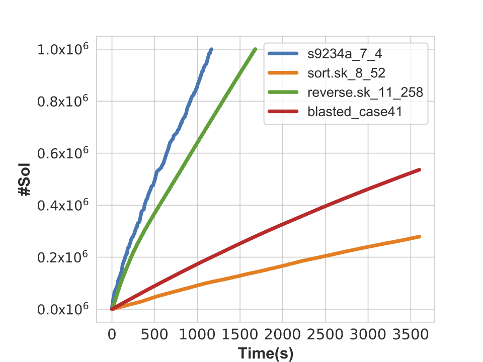
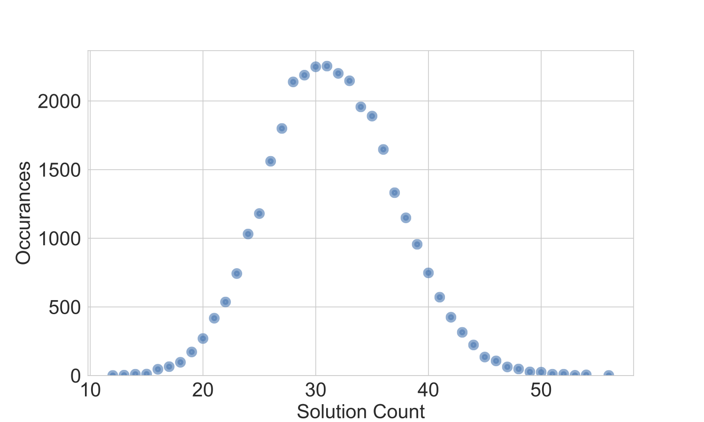
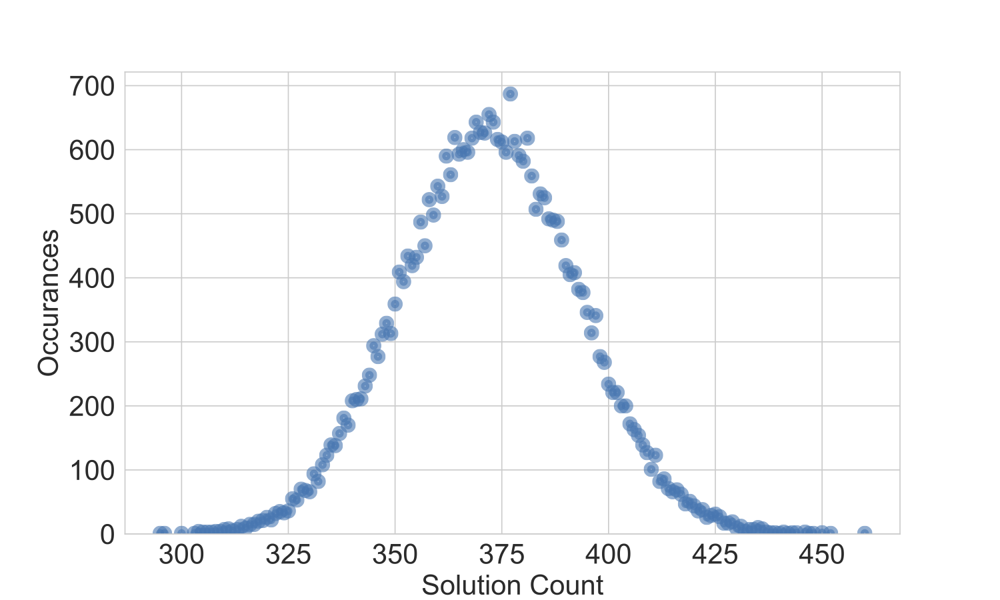
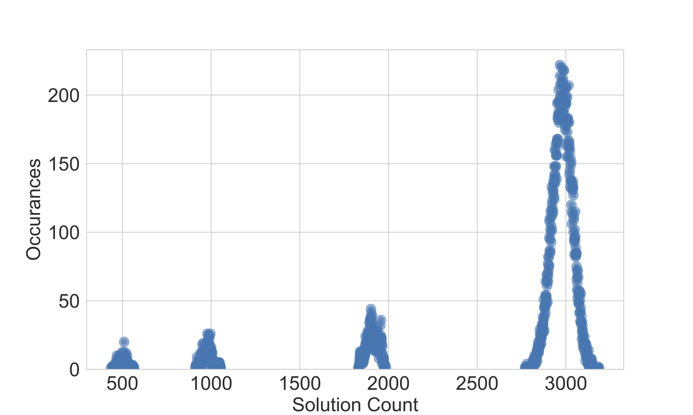
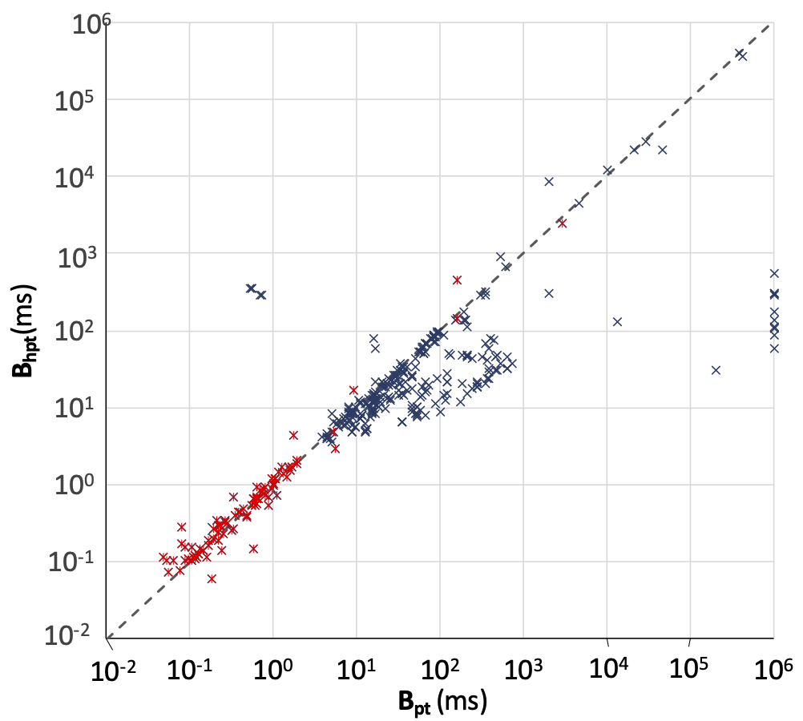
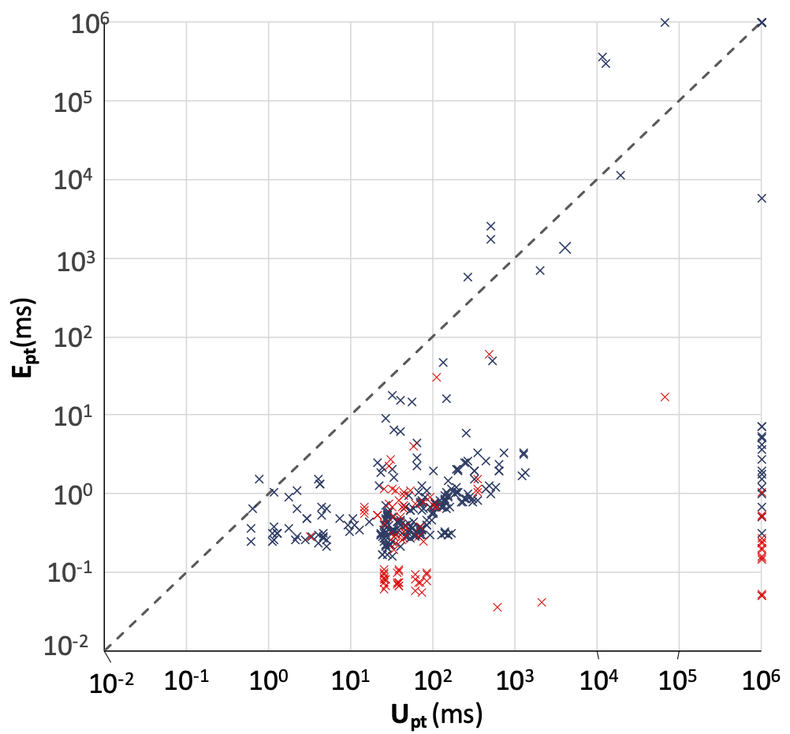
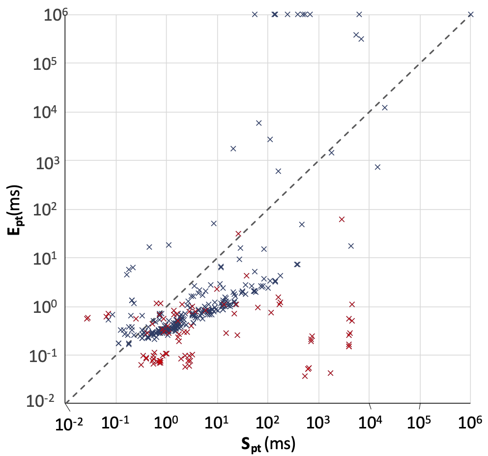

# Building
Linux environment is Required.
Install dependencies
```
sudo apt install git g++ make python-minimal
```

Clone repos
```
git clone https://github.com/ESampler/Esampler.git
git clone https://github.com/Z3Prover/z3.git
```

Build z3
```
cd z3
python scripts/mk_make.py
cd build
make
sudo make install
cd ../..
```

Build baseline ESampler

```
cd baseline
make
```

Build ESampler with QuickSampler as Solution Enumerator

```
cd extended
make
```

# Running

## Baseline

### Algorithm

Most smaplers have complex heuristic which may effect our evalution of the effectiveness of the deverivation procedure, the uniformity of the sampled solutions and the generating speed change over time, therefore, we implement a baseline ESampler with such simple algirithm as the seed enumerator:

randomly assign the variable in the independent support of the given formula and give it to the Max-SAT solver as soft constraints to get a seed solution each time.

We also propose a heuristic method to adjust the number of variables to assign for each Max-SAT round (trade-off between the solver time for each Max-SAT problem and the repeated rate of the seed generated). The heuristic is based on the repeated rate of the recent 100 seeds, and it will control the he number of variables to assign for each Max-SAT to maintain the repeated rate of the seed soutions in a reasonable range.

### Running
```
./esampler -n 1000000 -t 7200.0 -i -r --drv 50 -e formula.cnf
```

Use '-i' to enable the independent support information.

Use '-e' to enable enumerate mode, which only output unique solution.

Use '-n' to set the maximum samples number, default value is 10000000.

Use '-t' to set the time limit, default value is 7200.

Use '-r' to enable the heuristic soft constraint, which will random choose the soft constraint variable by the probility of the repeat rate of samples.

Use '-d' to enable debug mode, which will print debug information on the terminal.

Use '-nd' to disable the derivation procedure, default is enable.

Use '--drv' to set the max derivation limit in one derivation time, default is 10000.

## Extended
### Algorithm
Extended ESampler algirithm using QuickSampler as the seed enumerator.
### Running
```
./extended -n 1000000 -t 7200.0 --drv 50 -e formula.cnf
```
Use '-n' to set the maximum samples number, default value is 10000000.

Use '-t' to set the time limit, default value is 7200.

Use '-d' to enable the derivation procedure, default is disabled.

# Benchmarks
We use Benchmarks from UniGen. Find them [here](https://github.com/meelgroup/sampling-benchmarks/tree/master/unigen-benchmarks).

# Experiments

## Algorithm Speed
To test the relation of the time and the number of unique solutions generated, we run the baseline algorithm on some benchmarks. The result is showed in the figure below. We can see the relation is overally a linear relation with a bit decrease due to the decrease of the remaining solutions.



## Uniformity Test
To test the uniformity of the sampled solutions, we disable the enumerate mode and run the baseline algorithm. The follwing 3 figures are the results of the uniformity test on **27.sk_3_2** with derivation threshold 0, 10 and 100 for each seed. The x axis is the number of occurences of a solution in all solutions generated and the y axis is the number of unique solutions. For a ideally unform sampler, the distribution should be a normal distribution. We can see for derivation threshold 0 and 10, the distribution is almost a normal distribution, but for derivation threshold 100, it has some bias.



## Heuristic on Baseline Algorithm
We compare the baseline algorithm with and without the heuristic, the result of average time per sample for each algorithm is showed below. B<sub>hpt</sub> for baseline algorithm with heuristic and B<sub>pt</sub> for baseline algorithm with heuristic. The heuristic method accelarate the baseline algorithm 0.51 times overall.



## Other Comparision
We also do some comparision on the average time per sample for different algorithm, the results are showed on figures below. E<sub>pt</sub> for the ESampler with QuickSampler as the seed enumerator, U<sub>pt</sub> for UniGen3, Q<sub>pt</sub> for QuickSampler, S<sub>pt</sub> for SearchTreeSampler, M<sub>pt</sub> for the baseline algorithm without derivation procedure(only Max-SAT). The red color represent the derivation procedure works. On average, ESampler is 69.8× faster than UniGen3, 1.66× faster than QuickSampler, 4.47× faster than SearchTreeSampler. The baseline algorithm with derivation procedure is 3.71× faster than the Max-SAT one.  



[E_Bh](figs/E_Bh.png)!


